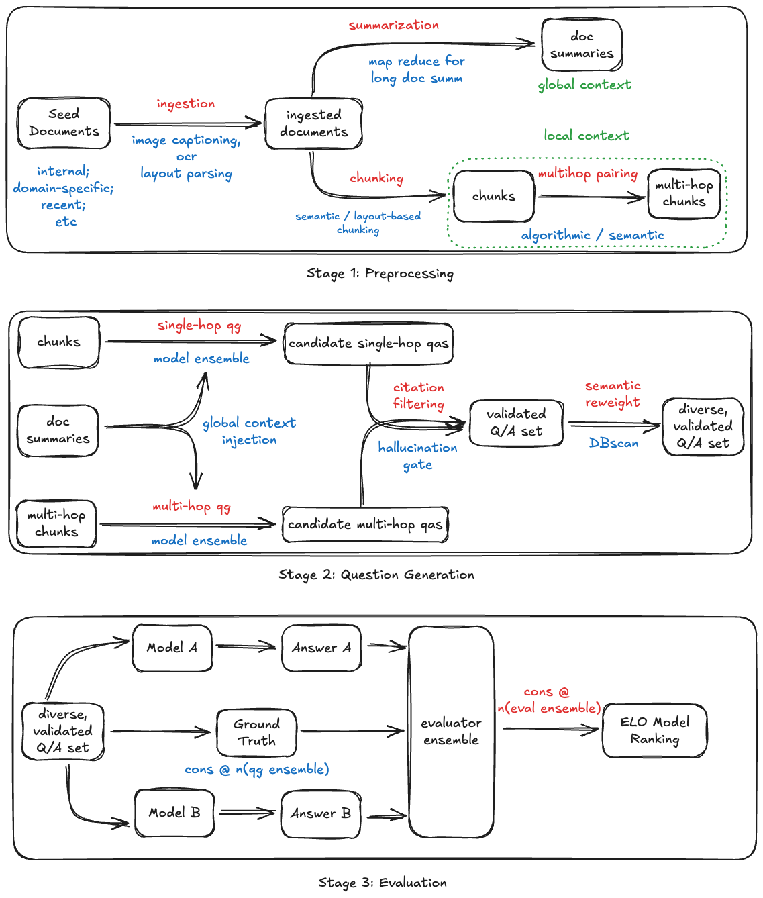

<div align="center">

<picture>
  <source media="(prefers-color-scheme: dark)" srcset="docs/assets/yourbench_banner_dark_mode.svg">
  <source media="(prefers-color-scheme: light)" srcset="docs/assets/yourbench_banner_light_mode.svg">
  
</picture>

<h2>YourBench: A Dynamic Benchmark Generation Framework</h2>

<a href="https://github.com/huggingface/yourbench/stargazers">
  
</a>

<p>
  <strong>
    [<a href="https://github.com/huggingface/yourbench">GitHub</a>] · 
    [<a href="https://huggingface.co/datasets/sumuks/tempora">Dataset</a>] · 
    [<a href="https://github.com/huggingface/yourbench/tree/main/docs">Documentation</a>] · 
    [<a href="https://arxiv.org/abs/2504.01833">Paper</a>]
  </strong>
</p>

</div>

---

> **YourBench** is an open-source framework for generating domain-specific benchmarks in a zero-shot manner. It aims to keep your large language models on their toes – even as new data sources, domains, and knowledge demands evolve.

YourBench tackles a critical evaluation gap for LLMs. Traditional static benchmarks are quickly **saturated** or contaminated by training data, making it hard to assess models on new knowledge. Domain-specific or up-to-date evaluation is often costly and slow with human annotation. **YourBench addresses this by enabling dynamic, automated generation of reliable, domain-tailored benchmarks directly from your data, without manual labeling**. In a recent study, YourBench replicated several subsets of a popular benchmark (MMLU) using minimal source text for **under \$15** in total cost, while preserving the original ranking of model performance (Spearman ρ = 1). By grounding questions in user-provided documents, YourBench ensures evaluations stay relevant and **truly test a model’s knowledge on content it hasn’t seen before**.

## Installation

YourBench is available on PyPI and requires **Python 3.12+**. You can install it as follows:

* **Install via PyPI (stable release):**

  ```bash
  # uv (recommended; get it here: https://docs.astral.sh/uv/getting-started/installation/)
  uv pip install yourbench

  # pip (standard support)
  pip install yourbench
  ```

  This will install the latest published version (e.g. `0.3.1`).

* **Install from source (development version):**

  ```bash
  git clone https://github.com/huggingface/yourbench.git
  cd yourbench
  
  # uv, recommended
  uv venv
  source .venv/bin/activate
  uv pip install -e .

  # pip
  pip install -e .
  ```

  Installing from source is recommended if you want the latest updates or to run the included example configuration.

> **Note:** If you plan to use models that require API access (e.g. OpenAI GPT-4o or Hugging Face Inference API), make sure to have the appropriate credentials. You’ll also need a Hugging Face token (to optionally to upload results). See below for how to configure these before running YourBench.

## Quickstart Usage

Once installed, YourBench can be run from the command line to generate a custom evaluation set. Here’s a quick example:

```bash
# 1. (Optional) If not done already, install YourBench
pip install yourbench

# 2. Prepare your API credentials (for model inference and Hub access)
# For example, create a .env file with required keys:
# echo "OPENROUTER_API_KEY=<your_openrouter_api_key>" >> .env        # Example
echo "HF_TOKEN=<your_huggingface_api_token>" >> .env              # Hugging Face token (for Hub datasets & inference)
echo "HF_ORGANIZATION=<your_hf_username_or_org>" >> .env          # (Optional) Organization name for dataset pushing

# 3. Run the pipeline on the provided example config (uses sample docs and models)
yourbench run --config example/configs/simple_example.yaml

# 4. (Optional) Run the pipeline on your own documents:
yourbench run --config my_custom_config.yaml
```

The **example configuration** `example/configs/simple_example.yaml` (included in the repository) demonstrates a basic setup. It specifies sample documents and default models for each stage of the pipeline. In step 3 above, YourBench will automatically ingest the example documents, generate a set of Q\&A pairs, and output a Hugging Face Dataset containing the evaluation questions and answers.

For your own data, you can create a YAML config pointing to your documents and preferred models. For instance, you might specify a folder of PDFs or text files under a `documents` field, and choose which LLM to use for question generation. **YourBench is fully configurable** – you can easily **toggle stages** on or off and swap in different models. *For example: you could disable the summarization stage for very short texts, or use a powerful, large, API model for question generation while using a faster local model for summarization.* The possibilities are endless! Simply adjust the YAML, and the pipeline will accommodate it. (See the [usage example](https://github.com/huggingface/yourbench/blob/main/example/configs/advanced_example.yaml) for all available options!)

## Process Flow



Under the hood, YourBench follows a multi-stage pipeline to turn raw documents into a ready-to-use benchmark dataset:

1. **Document Ingestion** – Convert PDFs, HTML, Word docs, or raw text files into a standardized format (Markdown) for downstream processing.
2. **Summarization** – Generate a concise *global summary* of each document using a designated summarization model. This helps distill key points and limit the scope for question generation.
3. **Chunking** – Split documents into smaller chunks (and optionally merge small pieces) based on semantic similarity or length constraints. This ensures long or complex documents are broken into manageable sections for Q\&A generation.
4. **Question Generation** – For each chunk (or combination of chunks), generate questions:

   * *Single-Hop:* Create straightforward questions answerable from a single chunk.
   * *Multi-Hop:* Combine multiple chunks to produce more complex questions that require integrating information from different parts of the content.
5. **Deduplication** – Remove or group together near-duplicate questions using embedding-based similarity, to avoid redundant entries in your benchmark.
6. **Analysis** – Evaluate the question set for coverage and difficulty. YourBench provides logging and analysis tools to measure how well the questions cover the source content, the distribution of topics, estimated difficulty levels, etc., and can run custom analysis modules.
7. **Export** – Finally, output the generated Q\&A benchmark. The results can be saved as a local dataset (using the Hugging Face `datasets` format) or even uploaded to the Hugging Face Hub for sharing. This makes it easy to evaluate models on the new benchmark or even set up a public leaderboard.

Throughout this process, **YourBench ensures the questions are grounded in your provided documents**, rather than what an LLM might already know. By using documents (and even an optional fresh document dataset like *Tempora-0325* for time-sensitive topics), the pipeline minimizes reliance on a model’s parametric memory, yielding more truthful and up-to-date evaluation queries.

## Try it Online (Hugging Face Spaces)

You can **try YourBench right away in your browser** – no installation needed:

* **[YourBench Demo Space](https://huggingface.co/spaces/yourbench/demo)** – Use our ready-to-go web demo to upload a document (or paste text) and generate a custom evaluation set with **one click**, complete with an instant model leaderboard. **(This free demo will use a default set of models to answer the questions and show how different models perform.)**
* **[YourBench Advanced Space](https://huggingface.co/spaces/yourbench/advanced)** – For power users, the advanced demo lets you provide a custom YAML config and plug in your own models or API endpoints. This gives you full control over the pipeline (choose specific models, adjust chunking parameters, etc.) via a convenient UI, right from the browser.

👉 Both hosted apps are available on Hugging Face Spaces under the **[yourbench](https://huggingface.co/yourbench)** organization. Give them a try to see how YourBench can generate benchmarks tailored to your use-case in minutes.

## Contributing

Contributions are welcome! If you’d like to improve YourBench or add new features, please follow these steps:

1. **Fork** the repository (on GitHub).
2. **Create a branch** for your feature (`git checkout -b feature/amazing-feature`).
3. **Install dev dependencies** (e.g. `pip install -r requirements.txt` or use `poetry/uv` if available) and set up the project for development.
4. **Make your changes**, adding new tests if applicable.
5. **Run tests** (`pytest`) and ensure code style compliance with `make style` and `make quality` (we use [Ruff](https://github.com/charliermarsh/ruff) for linting).
6. **Commit** your changes (`git commit -m 'Add amazing feature'`).
7. **Push** to your branch (`git push origin your-amazing-feature`).
8. Open a **Pull Request** on the main repository.

We actively review PRs and welcome improvements or fixes from the community. For major changes, feel free to open an issue first to discuss the idea.

## Highlights


* **Dynamic Benchmark Generation** – Produce diverse, up-to-date question-answer pairs derived from real-world source documents (PDF, Word, HTML, even multimedia).
* **Scalable & Structured** – Seamlessly handle ingestion, summarization, and multi-hop chunking for large or specialized datasets.
* **Extensible Pipeline** – Use out-of-the-box stages (ingestion, summarization, question generation) or plug in custom models and logic to accommodate domain-specific needs.
* **Robust Configuration** – Control the entire pipeline via a single YAML config (model choices, data paths, chunking parameters, generation prompts, deduplication thresholds, etc.).
* **Multi-Model Support** – Assign different LLMs for each stage (ingestion, summarization, QG, answering), fostering broader coverage and question-style diversity.
* **Deduplication & Quality Filtering** – Automatically group near-duplicates to prune questions and retain a curated set of high-quality queries.
* **Logging & Analysis** – Built-in metrics evaluate dataset coverage, question distribution, difficulty, and more.
* **Flexible Output** – Save generated benchmarks locally or push them to the Hugging Face Hub for sharing or public leaderboards.

<div align="center">

<a href="https://youtu.be/mhszO6kZSbI" target="_blank">
  
  <br/>
  
  <br/>
  <em>Watch our 3-minute demo of the YourBench pipeline</em>
</a>
</div>

## License

This project is licensed under the Apache 2.0 License – see the [LICENSE](LICENSE) file for details. You are free to use, modify, and distribute YourBench in either commercial or academic projects under the terms of this license.

## Citation

If you use **YourBench** in your research or applications, please consider citing our paper:

```bibtex
@misc{shashidhar2025yourbencheasycustomevaluation,
      title={YourBench: Easy Custom Evaluation Sets for Everyone},
      author={Sumuk Shashidhar and Clémentine Fourrier and Alina Lozovskia and Thomas Wolf and Gokhan Tur and Dilek Hakkani-Tür},
      year={2025},
      eprint={2504.01833},
      archivePrefix={arXiv},
      primaryClass={cs.CL},
      url={https://arxiv.org/abs/2504.01833}
}
```
